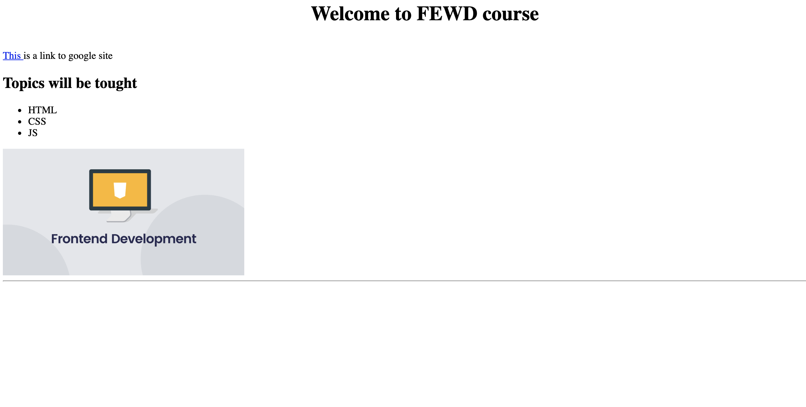

#  

## FEWD Week #1: HTML/CSS Basics

### How to submit homework

### Description

For the first assignment, you will make a simple website using HTML only. Take what you've learned from class and build a site. 

Build one page - an 'About the course' - using the HTML tages that you've learned in the class

### Technical Requirements
1. Show image using img tags
1. Use at least 6 different HTML tags (h1, h2, h3, h4, h5, h6, p, ul, ol, a, img) on your page
1. It should almost look like this page 
 

### Bonus
Experiment by adding additional CSS properties and link it to an external stylesheet to style your page, in additon to add some HTML tags we did not cover in class - explore!